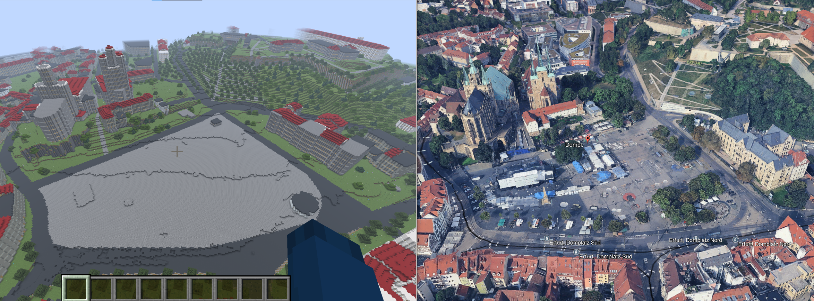
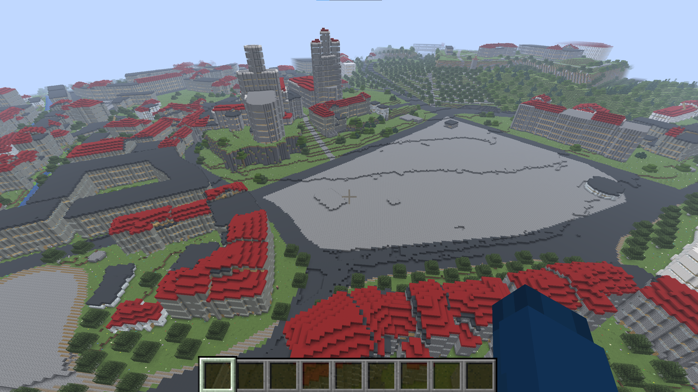
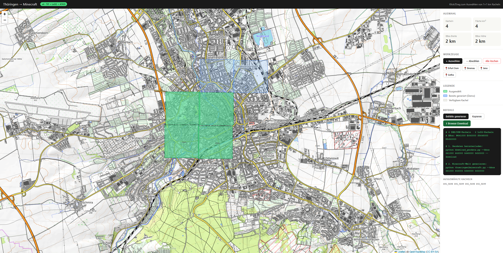

# 🗺️ thueringen2minecraft

**Thüringen als begehbare Minecraft-Welt — aus echten Geodaten.**

Konvertiert amtliche Geobasisdaten des Freistaats Thüringen automatisch in spielbare Minecraft Java 1.21.5-Welten. 1 Meter = 1 Block. Gebäude, Straßen, Gewässer, Vegetation — alles aus echten Messdaten.

---

## 🎮 Beispiel: Erfurt Domplatz

```bash
python download_geodata.py --bbox 641608 642172 5649006 5649363 --download
python thueringen2minecraft.py --bbox 641608 642172 5649006 5649363
```



*Links: Minecraft-Rekonstruktion. Rechts: Google Earth. Domplatz, Mariendom und Severikirche erkennbar.*



📦 **Beispielwelt direkt herunterladen** (119 MB, 7z):  
[thuringen2minecraft_output_erfurt01.7z](http://e.pc.cd/PvMy6alK)  
→ Entpacken nach `%AppData%\.minecraft\saves\`

---

## ⚠️ Known Bugs

Dies ist eine frühe Version — bekannte Probleme:

- **Treppenhäuser** — Positionierung und Übergänge noch fehlerhaft
- **Dächer** — Übergänge zwischen unterschiedlich hohen Gebäudeteilen nicht immer sauber
- **Kirchen** — Erkennung und Spitztürme noch in Arbeit

PRs willkommen!

---

## 🌐 Web-UI



`index.html` lokal öffnen oder auf GitHub Pages deployen:

- **OpenTopoMap** als Hintergrund (Höhenlinien, Wälder, Straßennamen)
- **UTM-Kachelgitter** ab Zoom 10, Koordinatenanzeige in Echtzeit
- **Klick + Drag** zum Auswählen mehrerer 1×1 km Kacheln
- Presets für Erfurt, Ilmenau, Jena, Gotha
- Befehle automatisch generieren + Browser-Download der ZIPs

---

## 🚀 Schnellstart

### 1. Abhängigkeiten

```bash
pip install numpy scipy geopandas shapely rasterio lxml nbtlib requests
```

### 2. Geodaten herunterladen

```bash
python download_geodata.py --bbox W E S N --download
```

### 3. Welt generieren

```bash
python thueringen2minecraft.py --bbox W E S N
```

Fertige Welt landet automatisch in `%AppData%\.minecraft\saves\`.

---

## 📦 Datenquellen

Alle Daten sind **Open Data** des Freistaats Thüringen (© GDI-Th, Datenlizenz Deutschland – Namensnennung 2.0):

| Daten | Auflösung | Inhalt |
|-------|-----------|--------|
| DGM1 | 1 m | Geländehöhen |
| DOM1 | 1 m | Oberflächenmodell (Vegetation) |
| LoD2 CityGML | 2×2 km Kacheln | 3D-Gebäude mit Dachformen |
| ATKIS Basis-DLM | Thüringen gesamt | Straßen, Gewässer, Vegetation, Kirchen |

---

## 🏗️ Architektur

```
thueringen2minecraft.py   ← Hauptskript
├── tile_loader.py         ← DGM/DOM GeoTIFF laden
├── lod2_loader.py         ← CityGML → Gebäude-Footprints + Höhen
├── atkis_layer.py         ← Shapefiles → Straßen, Gewässer, Vegetation
├── alkis_loader.py        ← ALKIS WFS → Gebäudefunktionscodes
├── entity_writer.py       ← Villager, Betten, Treppenhäuser, Laternen
└── anvil_writer.py        ← Minecraft .mca Regiondateien

download_geodata.py        ← Automatischer ZIP-Download + Entpacken
index.html                 ← Browser-UI zur Kachelauswahl
```

---

## 🎮 Was wird generiert

**Gebäude** (aus LoD2):
- Wandmaterial nach Höhe: stone_bricks → white_concrete → light_gray_concrete → quartz
- Einheitliches Material pro Gebäudekomponente
- Fenster auf allen Seiten, Spitzdächer aus LoD2-Dachinformation
- Übergangswände zwischen unterschiedlich hohen Gebäudeteilen
- Mehrere Treppenhäuser in großen Gebäuden (alle ~50 m)
- Hängende Laternen in allen Stockwerken

**Kirchen** (erkannt über ATKIS AX_Turm + LoD2 >40 m):
- Wände aus stone_bricks, automatische Erkennung

**Terrain & Umgebung**:
- Echte Topografie aus DGM1
- Straßen, Bahnlinien, Flüsse, Seen, Wald, Grünland
- Bäume mit realer Höhe aus DOM-nDSM

---

## 📁 Verzeichnisstruktur

```
thueringen2minecraft/
├── dgm/          ← DGM1 TIFs
├── dom/          ← DOM1 TIFs
├── LoD2/         ← CityGML Dateien
├── atkis/
│   ├── ver/      ← Verkehr
│   ├── gew/      ← Gewässer
│   ├── sie/      ← Siedlung (Türme, Kirchen)
│   └── veg/      ← Vegetation
└── alkis_gebaeude/  ← ALKIS WFS Cache
```

---

## 🌱 Vision: Thüringen komplett

Wir planen einen **Community-Server**, auf dem jeder ein Stück Thüringens berechnen und zur gemeinsamen Weltkarte beitragen kann:

1. Kacheln im Browser-UI auswählen
2. Geodaten automatisch herunterladen
3. Minecraft-Welt lokal generieren
4. Als PR einreichen → automatisch zur Gesamtkarte zusammengeführt

**Ziel: Thüringen 1:1 in Minecraft — von der Community gebaut.**

---

## 📄 Lizenz

**GNU Affero General Public License v3.0 (AGPL-3.0)**

Wer den Code nutzt, verändert oder auf einem Server betreibt, muss den Quellcode veröffentlichen. So bleibt das Projekt dauerhaft offen.

→ [LICENSE](LICENSE) · Geodaten: [Datenlizenz Deutschland – Namensnennung 2.0](https://www.govdata.de/dl-de/by-2-0) · © GDI-Th

---

## 🙏 Credits

Entwickelt in Ilmenau, Thüringen.  
Geodaten: Thüringer Landesamt für Bodenmanagement und Geoinformation (TLBG) / GDI-Th